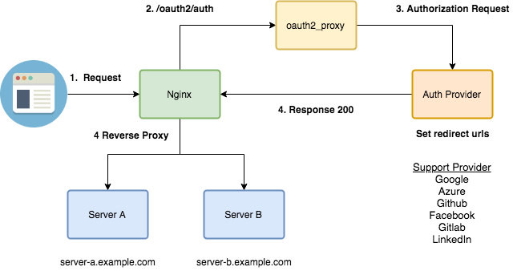

# Multiple Reverse Proxy Sapmle with oauth2_proxy

[oauth2_proxy](https://github.com/bitly/oauth2_proxy)を用いて、
複数のリバースプロキシ先をOAuth2で認証させるサンプルです。

## Architecture



## Usage

### Local

**準備**

リバースプロキシをする際、サブドメインで行う場合、トップレベルのドメインまで必要なので、ローカルで確認する場合は`/etc/hosts`ファイルを書き換える必要があります。

**その他設定**

1. ProviderからOAuthのClient IDと、Client Secret Keyを取得します。
2. `docker-compose.yml`の該当箇所に記入します。必要なら`.env`に切り出してください。
3. `COOKIE_DOMAIN`をサブドメインを含まずに記入します。
4. `COOKIE_NAME`、`COOKIE_SECRET`、`EMAIL_DOMAIN`はお好きにどうぞ。

**起動**

docker-composeで立ち上げる場合は下記のコマンドで完了です。

```bash
$ docker-compose up
```

**アクセス**

自分で設定したURLにアクセスして下さい。

#### 注意

**CSRFエラーが出る場合**

```
403 Permission Denied
csrf failed
```

_発生条件_

`COOKIE_DOMAIN`を`a.localhost.com`などとして、`a.localhost.com`にアクセスした後、`b.localhost.com`にアクセスした場合に生じます。

_原因_

Cookieが`a.localhost.com`にキャッシュされているにも関わらず、`b.localhost.com`で利用しようとしたためです。
コンソール上に`oauth2_proxy`がエラーログを吐き出します。

_解決策_

1. `COOKIE_DOMAIN`にサブドメインを含めずに記述する。
2. ブラウザのCookieを削除する。ホスト単位で削除する方法は各ブラウザの仕様を確認して下さい。

# TODO

- [x] 動くように
- [ ] Readmeの充実化
- [ ] Redirect URIを1つだけにできるかどうか確認する
    - 参考: https://github.com/bitly/oauth2_proxy/issues/237

# Made by

- 画像の作成 [draw.io](https://draw.io)

# Reference

Note: 新しい順

- 2017/12/14 [手っ取り早くウェブアプリケーションにOAuth2認証を導入する](http://moznion.hatenadiary.com/entry/2017/12/14/230945)
- 2017/04/05 [oauth2_proxyでRundeckにGitHub認証でログインする](https://qiita.com/minamijoyo/items/52041ff8628263355810)
- 2016/01/18 [oauth2_proxyとNginxのauth_requestを組み合わせると便利](http://lamanotrama.hateblo.jp/entry/2016/01/18/142116)
- [a5huynh/oauth2_proxy](https://github.com/a5huynh/oauth2_proxy)

# Author

- [Himenon](https://github.com/Himenon)

